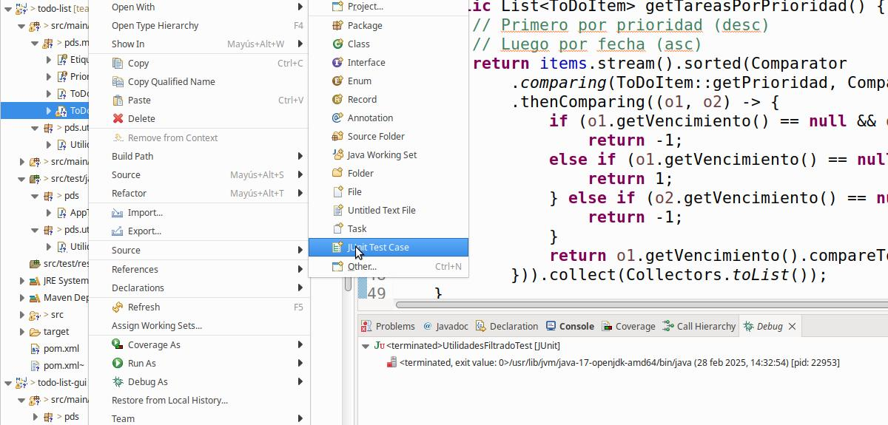
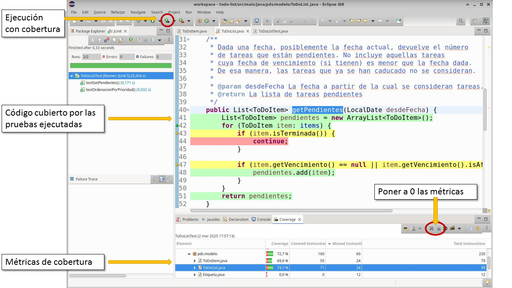

# Prácticas de pruebas de software

El objetivo de esta práctica es aprender cómo configurar y usar frameworks de pruebas para poder abordar el desarrollo de pruebas unitarias utilizando técnicas de caja negra y de caja blanca. 

Las tecnologías que se utilizarán serán:

 * Java - Lenguaje de programación
 * Maven - Configuración del proyecto
 * Eclipse - Entorno de desarrollo
 * JUnit - Framework de pruebas
 * AssertJ - Facilidades para escribir asertos
 * JaCoCo - Cobertura de código

La práctica se divide en varias tareas:

 0. [Inspeccionar proyecto](#proyecto)
 1. [Configurar Maven](#maven)
 2. [Pruebas unitarias - Pruebas de caja negra](#junit)
    - [Configurar JUnit](#junit.creacion)
    - [Ejercicios](#junit.ejercicios)
 3. [Tests parametrizdos](#parametrizados)
    - [Ejercicios](#parametrizados.ejercicios)
 4. [Pruebas de caja blanca](#whitebox)
    - [Pruebas de caja blanca en Eclipse](#whitebox.eclipse)
    - [Pruebas de caja blanca en Maven](#whitebox.maven)
    - [Ejercicios](#whitebox.coverage)
 5. [Mocks](#mocks)
 6. [Pruebas de integración](#integracion)
 7. [Pruebas de sistema](#sistema)
  

## Ejercicio #0. Inspeccionar el proyecto <a name="proyecto"></a>

Para la realización de esta práctica se proporciona 
un proyecto que contiene el código que hay que probar.
Se trata de una aplicación que permite al usuario crear listas de
tareas (_TO-DO List_).

El proyecto se encuentra en https://github.com/jesusc-umu/pds/tree/main/practicas/pruebas-software/todo-list

El proyecto está configurado como un proyecto Maven multi-módulo. Eso significa que hay un fichero POM padre y un directorio por cada módulo.

1. Dedica unos minutos a minutos a revisar cómo está configurado el fichero POM padre (que hace referencia los dos módulos hijos `todo-list` y `todo-list-gui`). 
2. Importa el proyecto en Eclipse y asegurate que compila correctamente.
3. Ejecuta la clase `App` (en el subproyecto `todo-list-gui`) para iniciar la aplicación.

Características básicas de la aplicación:

* Creación de listas de tareas
* Hay tres tipos de listas:
  - Listas normales, que se ordenan por prioridad de los elementos (en la implementación de la UI todas las tareas tienen prioridad NORMAL).
  - Listas fijas, que tienen un tamaño máximo. No se pueden añadir más de _n_ tareas.
  - Listas aleatorias, que ordenan las tareas aleatoriamente. La ordenación se realiza continuamente (ej., cada vez que se refresca la vista) o solo al insertar. 
* Creación de tareas en las listas.
* Inferencia de etiquetas para describir las tareas. Se proporciona una servicio basado en la API de OpenAI para obtener automáticamente etiquetas para las tareas.


## 1. Maven. <a name="maven"></a>

Antes de comenzar a escribir pruebas para el proyecto, es necesario configurar Maven para que incluya las dependencias a JUnit. JUnit es el framework de pruebas que se utilizará.

En el POM padre hay que incluir las dependencias de JUnit. 

```xml
  <properties>
    <junit.version>5.11.0</junit.version>
  </properties>

  <dependencies>
      <dependency>
      <groupId>org.junit.jupiter</groupId>
      <artifactId>junit-jupiter-api</artifactId>
      <version>${junit.version}</version>
      <scope>test</scope>
    </dependency>
    <!-- Soporte para tests parametrizados -->
    <dependency>
      <groupId>org.junit.jupiter</groupId>
      <artifactId>junit-jupiter-params</artifactId>
      <version>${junit.version}</version>
      <scope>test</scope>
    </dependency>
  </dependencies>
  
```

Aquí se están declarando dependencias para JUnit 5:

* `junit-jupiter-api`: Proporciona la API principal de JUnit 5 para escribir pruebas.
* `junit-jupiter-params`: Agrega soporte para pruebas parametrizadas, lo que permite ejecutar un mismo test con diferentes valores de entrada.
* `<scope>test</scope>`: Indica que estas dependencias solo se usarán en la fase de pruebas y no estarán en el código de producción.
* La versión concreta de JUnit se guarda en una propiedad `junit.version` para asegurar que cuando se cambie, cambie de igual manera en todas las dependencias relacionadas con JUnit.

JUnit proporciona una pequeña librería de asertos estandar, como `assertTrue`, `assertEquals`, etc. 
En ocasiones, es necesario escribir asertos más complejos y es útil utilizar librerías especializadas.
En este caso, utilizaremos [AssertJ](https://assertj.github.io/doc/).

Para incluir `AssertJ` en el proyecto, incluye en el POM:

```xml
<dependency>
  <groupId>org.assertj</groupId>
  <artifactId>assertj-core</artifactId>
  <version>3.27.2</version>
  <scope>test</scope>
</dependency>
```

## 2. Pruebas unitarias con JUnit <a name="junit"></a>

En esta tarea se utilizará JUnit para crear 
pruebas unitarias y se utilizarán técnicas de
pruebas de caja negra para derivar los casos de prueba.

### 2.1 Creación de una prueba unitaria
<a name="junit.creacion"></a>

En JUnit 5, los tests se escriben en clases Java normales donde cada test (caso de prueba) es un método anotado con `@Test`. 

Escribe el siguiente test para el método `esVencida`
de la clase `ToDoItem`.

En Maven, los tests se escriben en la carpeta `test/java`. La convención es escribir el nombre de la clase clase con el sufijo `Test` (ej., `ToDoItemTest`).

```java
package pds.modelo;

import static org.junit.jupiter.api.Assertions.*;

import java.time.LocalDate;

import org.junit.jupiter.api.Test;

class ToDoItemTest {

	@Test
	void testTareaEsVencida() {
		ToDoItem item = new ToDoItem("item de prueba");
		item.setVencimiento(LocalDate.of(2025, 01, 18));
		
		assertTrue(item.esVencida(LocalDate.of(2025, 01, 20)));
	}
  
  @Test
	void testTareaNoEsVencida() {
		ToDoItem item = new ToDoItem("item de prueba");
		item.setVencimiento(LocalDate.of(2025, 01, 18));
		
		assertFalse(item.esVencida(LocalDate.of(2025, 01, 16)));
	}

}
```

Para añadir una clase de prueba a una clase dada, puedes hacerlo automáticamente utilizando lo siguiente: `Botón derecho sobre el fichero de la clase, New -> JUnit Test Case`




Para ejecutar el código de pruebas hay varias opciones:

* Sobre una clase que implementa un _test case_, `Botón derecho -> Run as -> JUnit test`. 
* Utilizando un _Run configuration_. En el botón  , pulsar la flecha hacía abajo para ver las configuraciones creadas o para crear una nueva.
* Sobre un proyecto, `Botón derecho -> Run as -> JUnit test`, ejecutará todos los tests del proyecto.
* Desde la línea de comandos, utilizando Maven se podrán ejecutar todos los tests del proyecto con:

  ```bash
  $ mvn test
  ```

### 2.2 Ejercicios
<a name="junit.ejercicios"></a>
Realiza los siguientes ejercicios consistentes en crear nuevas pruebas unitarias **de caja negra**. Es decir, no es necesario mirar cómo está implementado el método que se está probando para crear los casos de prueba. Se proporciona la especificación de cada método. 

* Mejora el caso de prueba para el método `esVencida` para probar más casos. Intenta hacerlo sin mirar el código, básandote en la especificación.

  **Especificación**: _Comprueba si una tarea ha vencido en cierta fecha. En caso de que una tarea no tenga fecha de vencimiento, se considerará que la tarea nunca vence._

* Asegurate de haber creado un caso de prueba para el método `esVencida` que revele el error en su implementación. ¿Cuál es el defecto que has encontrado?

* Crea casos de prueba para el método `ToDoListNormal.getTareasEnOrden()` cuya especificación es:

	 **Especificación**: _Obtiene las tareas ordenadas según su prioridad. El orden de prioridad es ALTA, NORMAL y BAJA. En caso de tener la misma prioridad, las ordena por fecha de vencimiento._

  *Pista:* Para cada prueba tendrás que crear un objeto `ToDoList` y rellenarlo con `ToDoItem`s para configurar diferentes escenarios.

* Crea casos de prueba para el método `ToDoList.getPendientes(desdeFecha)`. 

  **Especificación**: _Dada una fecha, posiblemente la fecha actual, devuelve el número de tareas que están pendientes. No incluye aquellas tareas
   cuya fecha de vencimiento (si tienen) es menor que la fecha dada. De esa manera, las tareas que ya se han caducado no se consideran._

* Crea casos de prueba para el método `ToDoListFija.addItem`.

  **Especificación**: _Se añade una tarea a la lista solo si el número de tareas no supera el máximo número de tareas de la lista._

* Probar el método `UtilidadesFiltrado.esCompatibleConPatron(texto, patron)` (Opcional). El objetivo de este método es determinar si el texto satisface el patrón dado sabiendo que el patrón puede incluir '*' para indicar cualquier caracter.

  **Especificación**: _Comprueba si el texto dado como entrada satisface el patrón dado. Un patrón está compuesto de caracteres que tienen que encajar exáctamente en el texto y de '*' que significa que encaja 0 o más ocurrencias de caracteres._
	 
	_Por ejemplo,_
    - _esCompatibleConPatron('abc', 'a*') => true_
	- _esCompatibleConPatron('abc', 'a*d') => false_
  

## 3. Tests parametrizados
<a name="parametrizados"></a>

Los test parametrizados de JUnit permiten ejecutar el mismo caso de prueba varias veces con diferentes valores de entrada y expectativas (oráculos). 
Resultan útiles para reducir la duplicación de código
(es decir, escribir el mismo código de configuración y asertos continuamente) y mejora la claridad de las pruebas.

En JUnit 5, los test parametrizados se implementan con la anotación @ParameterizedTest, junto con diferentes fuentes de parámetros como @ValueSource, @CsvSource, @MethodSource, entre otros.

*Nota:* Los tests parametrizados son muy diferentes en JUnit 5 con respecto a JUnit 4. En todo caso, el concepto es el mismo.

El siguiente código muestra el test para el método `esVencida` expresado como un test parametrizado.

```java
package pds.modelo;

import static org.junit.jupiter.api.Assertions.assertEquals;

import java.time.LocalDate;
import java.util.List;

import org.junit.jupiter.params.ParameterizedTest;
import org.junit.jupiter.params.provider.Arguments;
import org.junit.jupiter.params.provider.MethodSource;

public class ToDoItemTest {

	private static List<Arguments> fechasParaEsVencida() {
		LocalDate fechaVencimiento = LocalDate.of(2025, 01, 18);
		return List.of(
			Arguments.of(fechaVencimiento, LocalDate.of(2025, 01, 20), true),
			Arguments.of(fechaVencimiento, LocalDate.of(2025, 01, 16), false)		
		);
	}
	
		
	@ParameterizedTest
	@MethodSource("fechasParaEsVencida")
	void testEsVencida(LocalDate vencimiento, LocalDate fechaComprobacion, boolean esVencida) {
		ToDoItem item = new ToDoItem("item de prueba");
		item.setVencimiento(vencimiento);
	
		assertEquals(esVencida, item.esVencida(fechaComprobacion));
	}
}
```

### 3.1 Ejercicio
<a name="parametrizados.ejercicios"></a>

* Copia la clase de test que has creado en el ejercicio anterior en una nueva clase (ej., `ToDoItemTest2`). Adapta la nueva la clase para que implemente los casos de prueba que tengan sentido como tests parametrizados.

  Fíjate en aquellos casos de prueba que repitan la configuración de los objetos varias veces pero con distintos valores. Los tests parametrizados permiten factorizar ese código de pruebas y separar los valores de entrada de los tests de cómo se configura.  

## 4. Pruebas de caja blanca con JaCoCo
<a name="whitebox"></a>

Para inspeccionar la cobertura del código que 
consiguen los casos de prueba creados se utilizará
la herramienta JaCoCo (https://www.jacoco.org/jacoco/).

JaCoCo ofrece varios tipos de [contadores](https://www.jacoco.org/jacoco/trunk/doc/counters.html) que utiliza para calcular varias métricas de cobertura. 

La siguiente imagen muestra la interfaz gráfica de JaCoCo. Ofrece un botón para ejecutar tests utilizando JaCoCo lo que hace que se "instrumente" el código de la aplicación y JaCoCo pueda saber qué instrucciones se han ejecutado. [Una vez ejecutadas las pruebas, se muestra en el editor con diferentes colores qué partes se han ejecutado](https://www.cs.cornell.edu/courses/JavaAndDS/files/codeCoverage.pdf).
Por último, en la vista "Coverage" se muestran las métricas de cobertura (abajo).



Es importante destacar que los contadores que usa JaCoCo está implementados a nivel del bytecode de Java, por lo que a veces los resultados no se pueden "mapear" de manera precisa al código fuente original.

En esta práctica se utilizarán estas dos métricas:

* **Cobertura de líneas**. En una línea puede haber varias instrucciones y JaCoCo reporta tres situaciones.

  * Sin cobertura (<span style='color: red'>rojo</span>). No se ha ejecutado ninguna instrucción de esa línea.
  * Cobertura parcial (<span style='color: yellow'>amarillo</span>). Se han ejecutado algunas instrucciones de esa línea, pero no todas.
  * Coberatura total (<span style='color: green'>verde</span>). Se han ejecutado todas las instrucciones de la línea.

* **Cobertura de ramas**.

  * Sin cobertura (<span style='color: red'>diamante rojo</span>). El condicional de esa línea no se ha ejecutado.

  * Cobertura parcial (<span style='color: yellow'>diamante amarillo</span>). Se ha ejecutado alguna de las ramas del condicional (ej., una rama en un `if-else`). 

  * Cobertura total (<span style='color: green'>diamante verde</span>). Se han ejecutado todas las ramas del condicional.


### 4.1 Ejercicio - Ejecutar pruebas con cobertura de código desde Eclipse
<a name="whitebox.eclipse"></a>


Eclipse incluye un plug-in que permite ejecutar los casos de prueba midiendo la cobertura. Para ello utiliza JaCoCo. La imagen anterior muestra cómo ejecutarlo.

1. Ejecuta los tests anteriores utilizando la herramienta de cobertura. Estudia la salida y relaciona los casos de prueba con la cobertura obtenida (ej., líneas amarillas y rojas).

   **Importante**: A la hora de ejecutar las pruebas es importante tener en cuenta que si solo se ejecuta clase de prueba, la herramienta de cobertura muestra la cobertura para esa clase solamente. Para ver la cobertura de todo el proyecto, hay que ejecutar las pruebas tal y como se indicó antes: `Botón derecho en el proyecto -> Run as -> JUnit test`.


### 4.2 Ejecutar con cobertura de código de Maven
<a name="whitebox.maven"></a>

Para poder ejecutar las pruebas de caja blanca, hay que modificar la configuración de Maven para que incluya la instrumentación de JaCoCo.

```xml
<plugin>
    <groupId>org.jacoco</groupId>
    <artifactId>jacoco-maven-plugin</artifactId>
    <version>0.8.12</version>
    <executions>
        <execution>
            <goals>
                <goal>prepare-agent</goal>
            </goals>
        </execution>
        <execution>
            <id>report</id>
            <phase>prepare-package</phase>
            <goals>
                <goal>report</goal>
            </goals>
        </execution>
    </executions>
</plugin>

```

### 4.3 - Ejercicio - Mejorar la cobertura
<a name="whitebox.coverage"></a>

En los ejercicios anteriores has probado algunos  métodos utilizando técnicas de caja negra. 

En este ejercicio ejecuta las pruebas utilizando la herramienta de análisis de cobertura y complementa las pruebas con pruebas de caja blanca, tratando de mejorar la cobertura.


## 5. Mocks
<a name="mocks"></a>

En esta parte de la práctica se desean realizar pruebas al controlador de la aplicación `ControladorToDo`. 

Antes de comenzar con las pruebas de esta clase se presenta 
la librería Mockito que nos va a permitir crear _mocks_ para poder probar clases que tienen dependencias con otras clases.

### 5.1 Mockito
[Mockito](https://site.mockito.org/) es un framework de mocking para Java, utilizado principalmente en pruebas unitarias para simular el comportamiento de dependencias sin necesidad de crear implementaciones reales.

Esencialmente Mockito permite configurar la creación de una subclase de un tipo dado, indicando qué tienen los métodos cuando se invocan. También ofrece facilidades para comprobar si las funciones de una clase se han invovcvado, qué valores han tomado los parámetros, etc.

A continuación se muestra un ejemplo:

```java
import org.junit.jupiter.api.Test;
import org.mockito.Mockito;

import static org.junit.jupiter.api.Assertions.assertEquals;
import static org.mockito.Mockito.*;

// Las clases Servicio y Clienet se definen aquí por simplicidad
class Servicio {
    public String obtenerDato() {
        return "Dato real";
    }
}

class Cliente {
    private final Servicio servicio;

    public Cliente(Servicio servicio) {
        this.servicio = servicio;
    }

    public String procesar() {
        return "Procesado: " + servicio.obtenerDato();
    }
}

public class ClienteTest {

    @Test
    void testProcesar() {
        // 1. Crear una subclase de Servicio que actuará como Mock
        Servicio servicioMock = Mockito.mock(Servicio.class);

        // 2. Definir el comportamiento del mock
        when(servicioMock.obtenerDato()).thenReturn("Dato simulado");

        // 3. Crear instancia de la clase que se va a probar
        Cliente cliente = new Cliente(servicioMock);

        // 4. Ejecutar método y verificar resultado
        String resultado = cliente.procesar();
        assertEquals("Procesado: Dato simulado", resultado);

        // 5. Verificar que el método se llamó una vez
        verify(servicioMock, times(1)).obtenerDato();
    }
}
```

Los método principales para usar Mockito son:

* `Mockito.mock(Servicio.class)`. Creación del mock. Esencialmente crea una subclase del tipo dado.
* `when().thenReturn()`. Especificamos el comportamiento del mock.
* `assertEquals()`. Se utiliza la API de JUnit normalmente.
* `verify()`. Comprobamos que el método obtenerDato() se llamó exactamente una vez. 


### 5.2. Identificar dependencias

La clase `ControladorToDo` tiene dos dependencias que complican realizar pruebas porque habría que configurarlas a la hora de realizar el caso de prueba. 

En esta parte de la práctica realiza lo siguiente:

1. Abre la clase del controlador e identifica las dos dependencias. ¿Qué impacto tendría realizar pruebas sobre la clase Controlador tal y como está diseñada?

2. Corrige la clase `ControladoToDo` para sea más fácil probarla (_testability_).

### 5.3. Ejercicio

Crea una nueva clase, `ControladorToDoTest`, para definir casos de prueba para el controlador.

Utiliza Mockito para realizar pruebas de los diferentes métodos del controlador. 

## 6. Pruebas de integración
<a name="integracion"></a>

Una vez que se ha probado el controlador de manera aislada, se probará junto con la base de datos para comprobar que efectivamente se guardan y recuperan correctamente los datos.

1. Configura un test (utilizando las anotaciones `@BeforeEach` y `@AfterEach`) para asegurar que cada test comienza con una base de datos limpia.

2. Escribe algunos tests simples para comprobar que el controlador se integra correctamente con la base de datos.

## 7. Pruebas de sistema
<a name="sistema"></a>

Para hacer pruebas de sistema para una interfaz de usuario en Java/Swing no hay demasiadas alternativas. Se puede utilizra Jemmy, pero es necesario programar a mano toda la interacción.

Algunos recursos son:
* [GitHub de Jemmy](https://github.com/openjdk/jemmy-v2)
* [Tutorial de Jemmy](https://github.com/openjdk/jemmy-v2/blob/master/doc/tutorial.html)
* [Transparencias de introducción a Jemmy](https://es.slideshare.net/slideshow/jemmy-introduction/13640432#29)


